# Diagramas Específicos del Sistema de Gestión de Permisos

A continuación se presentan los diagramas clave del sistema, cada uno con su descripción y utilidad.

---

## 1. Diagrama de Casos de Uso (UML)

**¿Qué muestra?**  
Las acciones principales que pueden realizar los usuarios y administradores en el sistema.

**¿Para qué sirve?**  
Visualizar los requerimientos funcionales y la interacción de los actores con el sistema.

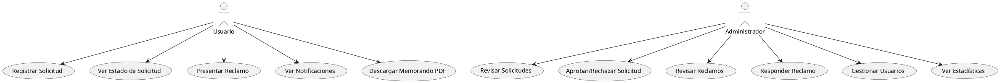

---

## 2. Diagrama de Clases (UML)

**¿Qué muestra?**  
Las clases principales del sistema, sus atributos y relaciones.

**¿Para qué sirve?**  
Explicar la estructura de datos y la lógica orientada a objetos del backend.

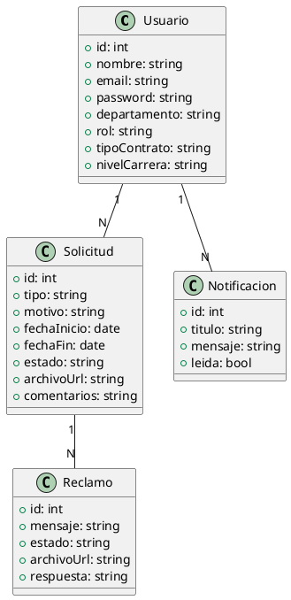

---

## 3. Diagramas de Secuencia (UML)

**¿Qué muestra?**  
El orden de las interacciones entre usuario, frontend, backend y base de datos para cada operación relevante.

**¿Para qué sirve?**  
Documentar el flujo de los procesos clave.

---

### 3.1 Usuario: Registrar Solicitud

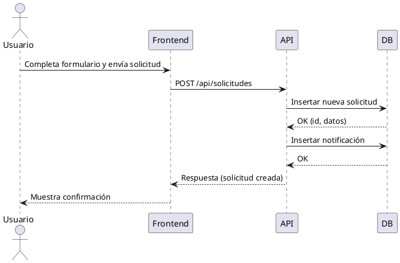

---

### 3.2 Usuario: Consultar Estado de Solicitud

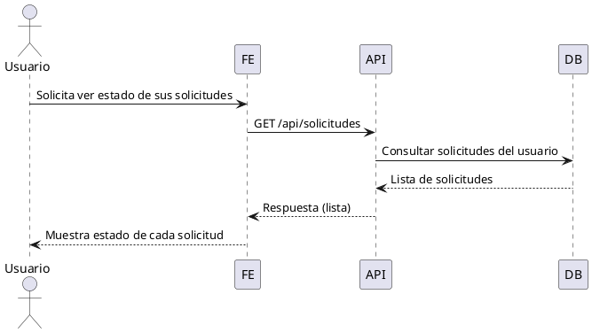

---

### 3.3 Usuario: Presentar Reclamo

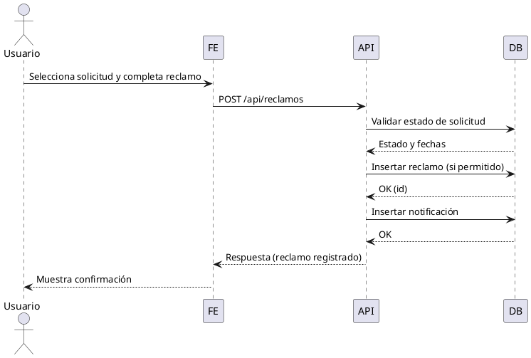

---

### 3.4 Usuario: Ver Notificaciones

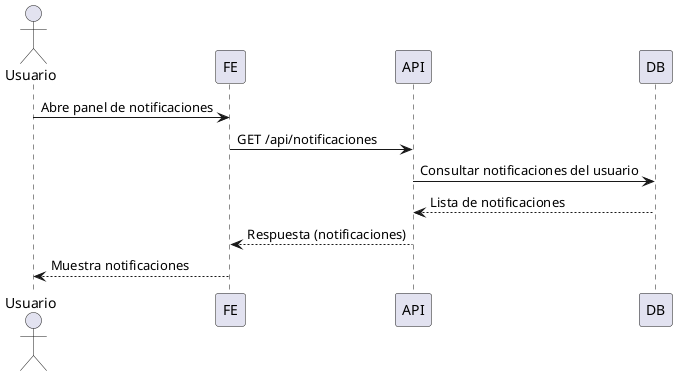

---

### 3.5 Usuario: Descargar Memorando PDF

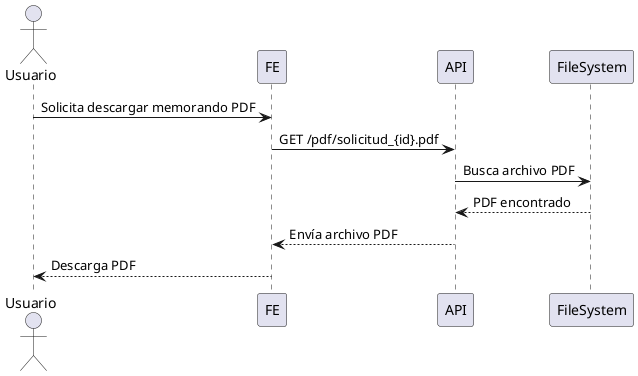

---

### 3.6 Administrador: Revisar Solicitudes

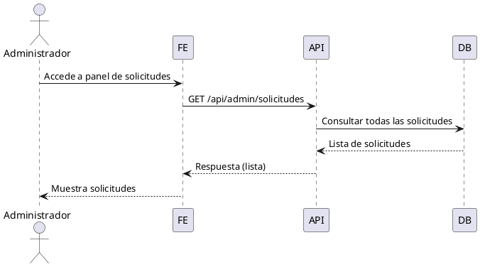

---

### 3.7 Administrador: Aprobar/Rechazar Solicitud

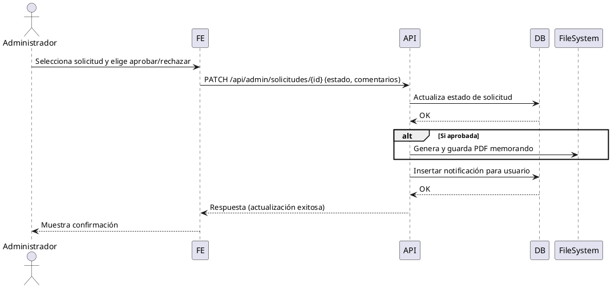

---

### 3.8 Administrador: Revisar Reclamos

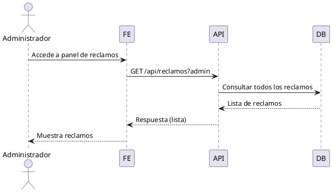

---

### 3.9 Administrador: Responder Reclamo

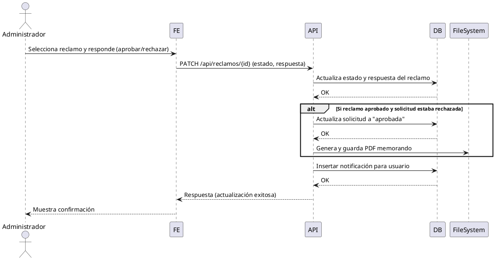

---

### 3.10 Administrador: Gestionar Usuarios

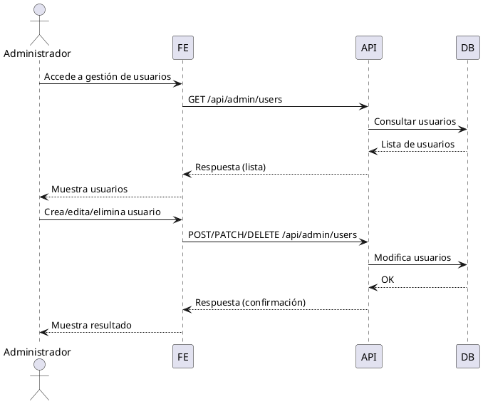

---

### 3.11 Administrador: Ver Estadísticas

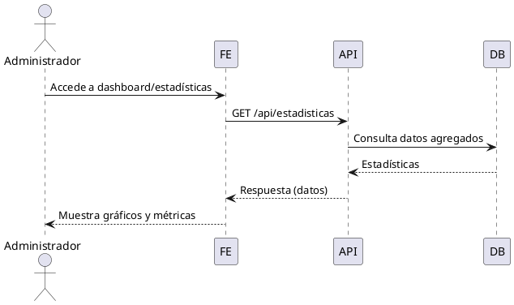

---

## 4. Diagramas de Actividades (UML)

**¿Qué muestra?**  
El flujo de tareas y decisiones para cada operación relevante.

**¿Para qué sirve?**  
Visualizar procesos con decisiones y ramificaciones.

---

### 4.1 Usuario: Registrar Solicitud

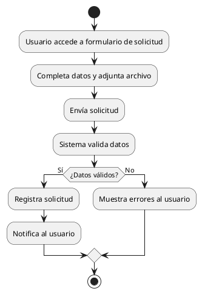

---

### 4.2 Usuario: Consultar Estado de Solicitud

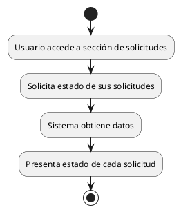

---

### 4.3 Usuario: Presentar Reclamo

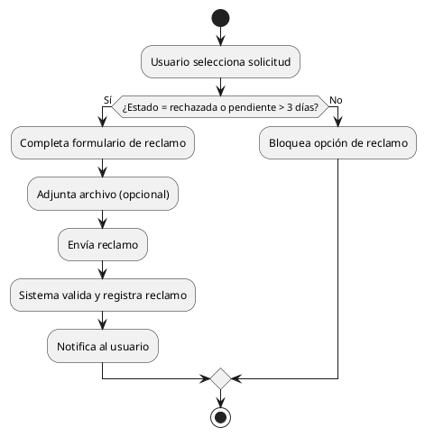

---

### 4.4 Usuario: Ver Notificaciones

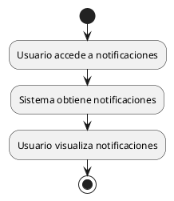

---

### 4.5 Usuario: Descargar Memorando PDF

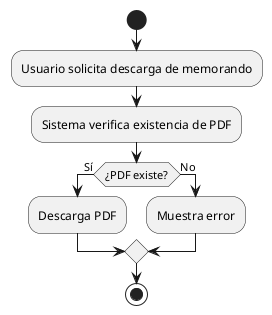

---

### 4.6 Administrador: Revisar Solicitudes

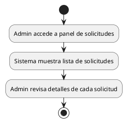

---

### 4.7 Administrador: Aprobar/Rechazar Solicitud

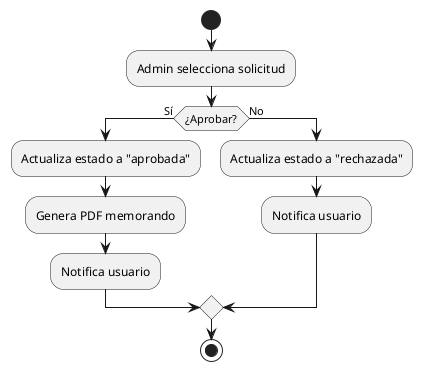

---

### 4.8 Administrador: Revisar Reclamos

```plantuml
@startuml
start
:Admin accede a panel de reclamos;
:Sistema muestra lista de reclamos;
:Admin revisa detalles de cada reclamo;
stop
@enduml
```

---

### 4.9 Administrador: Responder Reclamo

```plantuml
@startuml
start
:Admin selecciona reclamo;
if (¿Aprobar reclamo?) then (Sí)
  :Actualiza estado a "aprobado";
  :Actualiza solicitud si corresponde;
  :Genera PDF si corresponde;
  :Notifica usuario;
else (No)
  :Actualiza estado a "rechazado";
  :Notifica usuario;
endif
stop
@enduml
```

---

### 4.10 Administrador: Gestionar Usuarios

```plantuml
@startuml
start
:Admin accede a gestión de usuarios;
:Sistema muestra lista de usuarios;
:Admin crea/edita/elimina usuario;
:Sistema actualiza base de datos;
:Notifica resultado;
stop
@enduml
```

---

### 4.11 Administrador: Ver Estadísticas

```plantuml
@startuml
start
:Admin accede a dashboard/estadísticas;
:Sistema consulta datos agregados;
:Presenta gráficos y métricas;
stop
@enduml
```

---

## 5. Diagrama de Componentes (UML)

**¿Qué muestra?**  
La división lógica del sistema en módulos/componentes.

**¿Para qué sirve?**  
Explicar la arquitectura lógica y dependencias.

```plantuml
@startuml
package "Frontend (Next.js)" {
  [UI React Components]
}

package "Backend (API Next.js)" {
  [API Endpoints]
  [Auth Service]
  [PDF Generator]
}

package "Base de Datos (PostgreSQL)" {
  [Tablas: usuarios, solicitudes, reclamos, notificaciones]
}

[UI React Components] --> [API Endpoints]
[API Endpoints] --> [Auth Service]
[API Endpoints] --> [PDF Generator]
[API Endpoints] --> [Tablas: usuarios, solicitudes, reclamos, notificaciones]
@enduml
```

---

## 6. Diagrama de Despliegue (UML)

**¿Qué muestra?**  
La distribución del sistema en servidores y recursos.

**¿Para qué sirve?**  
Visualizar el entorno de ejecución y despliegue.

```plantuml
@startuml
node "Servidor Web" {
  component "Next.js App"
}

node "Servidor Archivos" {
  folder "/public/uploads"
  folder "/public/pdf"
}

database "PostgreSQL" {
}

"Next.js App" --> "PostgreSQL"
"Next.js App" --> "/public/uploads"
"Next.js App" --> "/public/pdf"
@enduml
```

---

## 7. Diagramas Generales

A continuación se presentan diagramas generales para cada tipo UML, que resumen el funcionamiento global del sistema, enfocados en la usabilidad y experiencia de usuario.

---

### 7.1 Diagrama General de Secuencia

```plantuml
@startuml
actor Usuario
actor Administrador
participant "Frontend" as FE
participant "API" as API
participant "DB" as DB
participant "FileSystem" as FS

Usuario -> FE : Navega por el sistema
Usuario -> FE : Realiza acción (crear solicitud, consultar estado, presentar reclamo, ver notificaciones, descargar PDF)
FE -> API : Envía petición correspondiente
API -> DB : Consulta o actualiza información
API -> FS : Accede a archivos (si aplica)
DB --> API : Devuelve datos
FS --> API : Devuelve archivo (si aplica)
API --> FE : Devuelve información o archivo
FE --> Usuario : Muestra resultados, notificaciones o descarga

Administrador -> FE : Accede a panel de administración
Administrador -> FE : Realiza acción (revisar solicitudes, aprobar/rechazar, gestionar usuarios, responder reclamos, ver estadísticas)
FE -> API : Envía petición administrativa
API -> DB : Consulta o actualiza información administrativa
API -> FS : Genera/descarga PDF (si aplica)
DB --> API : Devuelve datos
FS --> API : Devuelve archivo (si aplica)
API --> FE : Devuelve información o archivo
FE --> Administrador : Muestra resultados, paneles y descargas
@enduml
```

---

### 7.2 Diagrama General de Actividades

```plantuml
@startuml
start
:Usuario/Administrador accede al sistema;
:Visualiza menú principal con opciones (Solicitudes, Reclamos, Notificaciones, Usuarios, Estadísticas);
partition Usuario {
  :Selecciona "Registrar Solicitud";
  :Completa formulario y adjunta archivo;
  :Envía solicitud;
  :Visualiza confirmación y estado de solicitud;
  :Puede seleccionar "Presentar Reclamo" sobre una solicitud;
  :Completa formulario de reclamo y adjunta archivo (opcional);
  :Envía reclamo;
  :Visualiza confirmación y seguimiento de reclamos;
  :Consulta notificaciones recibidas;
  :Descarga memorando PDF de solicitudes aprobadas;
}
partition Administrador {
  :Selecciona "Revisar Solicitudes";
  :Visualiza lista y detalles de solicitudes;
  :Aprueba o rechaza solicitudes (puede agregar comentarios);
  :Genera y almacena PDF de memorando si aprueba;
  :Notifica al usuario solicitante;
  :Selecciona "Revisar Reclamos";
  :Visualiza lista y detalles de reclamos;
  :Responde reclamos (aprueba/rechaza y agrega respuesta);
  :Si corresponde, actualiza estado de solicitud y genera PDF;
  :Gestiona usuarios (crea, edita, elimina, consulta);
  :Accede a "Ver Estadísticas" para consultar métricas y reportes;
}
:Ambos pueden navegar entre funcionalidades y recibir notificaciones en tiempo real;
stop
@enduml
```

---

### 7.3 Diagrama General de Flujo

```plantuml
@startuml
start
:Inicio;
:Usuario/Administrador ingresa al sistema (login);
:Sistema muestra menú principal con módulos disponibles;
if (¿Usuario?) then (Sí)
  :Elige acción (Registrar Solicitud, Consultar Estado, Presentar Reclamo, Ver Notificaciones, Descargar PDF);
  if (Registrar Solicitud) then (Sí)
    :Completa y envía formulario;
    :Sistema valida y registra solicitud;
    :Usuario recibe confirmación y puede consultar estado;
  endif
  if (Presentar Reclamo) then (Sí)
    :Selecciona solicitud;
    :Completa y envía formulario de reclamo;
    :Sistema valida y registra reclamo;
    :Usuario recibe confirmación y seguimiento;
  endif
  if (Ver Notificaciones) then (Sí)
    :Sistema muestra notificaciones relevantes;
  endif
  if (Descargar PDF) then (Sí)
    :Solicita descarga de memorando;
    :Sistema entrega archivo si está disponible;
  endif
else (Administrador)
  :Elige acción (Revisar Solicitudes, Aprobar/Rechazar, Revisar/Responder Reclamos, Gestionar Usuarios, Ver Estadísticas);
  if (Revisar Solicitudes) then (Sí)
    :Visualiza lista y detalles;
    :Aprueba o rechaza, agrega comentarios;
    :Genera PDF y notifica usuario si aprueba;
  endif
  if (Revisar/Responder Reclamos) then (Sí)
    :Visualiza lista y detalles;
    :Responde reclamo (aprueba/rechaza, agrega respuesta);
    :Actualiza solicitud y genera PDF si corresponde;
    :Notifica usuario;
  endif
  if (Gestionar Usuarios) then (Sí)
    :Crea, edita, elimina o consulta usuarios;
  endif
  if (Ver Estadísticas) then (Sí)
    :Consulta métricas y reportes del sistema;
  endif
endif
:Usuario/Administrador puede repetir acciones o cerrar sesión;
stop
@enduml
```

---

## 8. Diagrama de Base de Datos / Modelo ER

**¿Qué muestra?**  
Las tablas principales y sus relaciones.

**¿Para qué sirve?**  
Explicar la estructura de almacenamiento de datos.

```plantuml
@startuml
entity Usuario {
  id PK
  nombre
  email
  password
  departamento
  rol
  tipo_contrato
  nivel_carrera
}

entity Solicitud {
  id PK
  usuario_id FK
  tipo
  motivo
  fecha_inicio
  fecha_fin
  estado
  archivo_url
  comentarios
}

entity Reclamo {
  id PK
  solicitud_id FK
  usuario_id FK
  mensaje
  estado
  archivo_url
  respuesta
}

entity Notificacion {
  id PK
  usuario_id FK
  titulo
  mensaje
  leida
}

Usuario ||--o{ Solicitud
Solicitud ||--o{ Reclamo
Usuario ||--o{ Reclamo
Usuario ||--o{ Notificacion
@enduml
```

---

## 9. Diagrama de Flujo (Flowchart)

**¿Qué muestra?**  
El flujo lógico para presentar un reclamo.

**¿Para qué sirve?**  
Explicar la lógica de validación y registro de reclamos.

```plantuml
@startuml
start
:Usuario selecciona solicitud;
if (¿Estado = rechazada o pendiente > 3 días?) then (Sí)
  :Completa formulario de reclamo;
  :Adjunta archivo (opcional);
  :Envía reclamo;
  :Sistema valida y registra reclamo;
  :Notifica al usuario;
else (No)
  :Bloquea opción de reclamo;
endif
stop
@enduml
```

---

## 10. Diagramas de Flujo (Flowchart)

**¿Qué muestra?**  
El flujo lógico y validaciones para cada operación relevante.

**¿Para qué sirve?**  
Explicar la lógica de validación y registro de cada proceso.

---

### 10.1 Registrar Solicitud

```plantuml
@startuml
start
:Usuario llena formulario;
:Adjunta archivo;
:Envía solicitud;
if (¿Datos válidos?) then (Sí)
  :Registrar solicitud;
  :Notificar usuario;
else (No)
  :Mostrar error;
endif
stop
@enduml
```

---

### 10.2 Consultar Estado de Solicitud

```plantuml
@startuml
start
:Usuario solicita estado;
:Sistema obtiene solicitudes;
:Presenta estado;
stop
@enduml
```

---

### 10.3 Presentar Reclamo

```plantuml
@startuml
start
:Usuario selecciona solicitud;
if (¿Rechazada?) then (Sí)
  :Permitir reclamo;
else (No)
  if (¿Pendiente > 3 días?) then (Sí)
    :Permitir reclamo;
  else (No)
    :Bloquear reclamo;
  endif
endif
if (¿Permitir reclamo?) then (Sí)
  :Usuario llena formulario;
  :Adjunta archivo;
  :Envía reclamo;
  :Registrar reclamo;
  :Notificar usuario;
endif
stop
@enduml
```

---

### 10.4 Ver Notificaciones

```plantuml
@startuml
start
:Usuario accede a notificaciones;
:Sistema obtiene y muestra notificaciones;
stop
@enduml
```

---

### 10.5 Descargar Memorando PDF

```plantuml
@startuml
start
:Usuario solicita PDF;
if (¿PDF existe?) then (Sí)
  :Descargar PDF;
else (No)
  :Mostrar error;
endif
stop
@enduml
```

---

### 10.6 Revisar Solicitudes (Admin)

```plantuml
@startuml
start
:Admin accede a solicitudes;
:Sistema muestra lista;
:Admin revisa detalles;
stop
@enduml
```

---

### 10.7 Aprobar/Rechazar Solicitud (Admin)

```plantuml
@startuml
start
:Admin selecciona solicitud;
if (¿Aprobar?) then (Sí)
  :Actualizar a "aprobada";
  :Generar PDF;
  :Notificar usuario;
else (No)
  :Actualizar a "rechazada";
  :Notificar usuario;
endif
stop
@enduml
```

---

### 10.8 Revisar Reclamos (Admin)

```plantuml
@startuml
start
:Admin accede a reclamos;
:Sistema muestra lista;
:Admin revisa detalles;
stop
@enduml
```

---

### 10.9 Responder Reclamo (Admin)

```plantuml
@startuml
start
:Admin selecciona reclamo;
if (¿Aprobar reclamo?) then (Sí)
  :Actualizar a "aprobado";
  :Actualizar solicitud si corresponde;
  :Generar PDF si corresponde;
  :Notificar usuario;
else (No)
  :Actualizar a "rechazado";
  :Notificar usuario;
endif
stop
@enduml
```

---

### 10.10 Gestionar Usuarios (Admin)

```plantuml
@startuml
start
:Admin accede a usuarios;
:Sistema muestra lista;
:Admin crea/edita/elimina usuario;
:Actualizar base de datos;
:Notificar resultado;
stop
@enduml
```

---

### 10.11 Ver Estadísticas (Admin)

```plantuml
@startuml
start
:Admin accede a dashboard;
:Sistema consulta datos;
:Presenta métricas;
stop
@enduml
```
