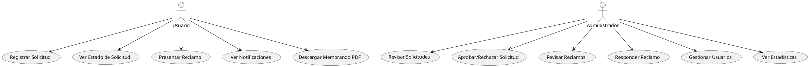
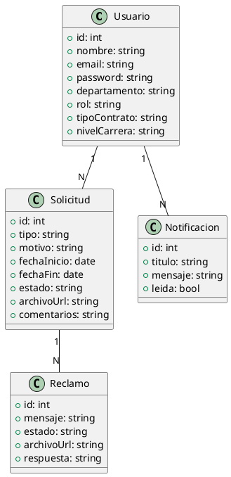
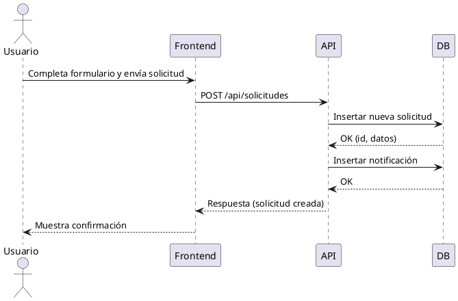
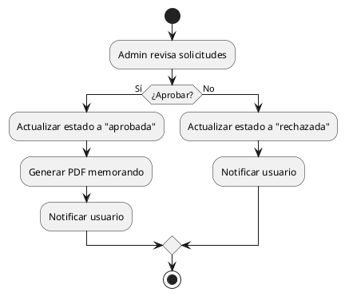
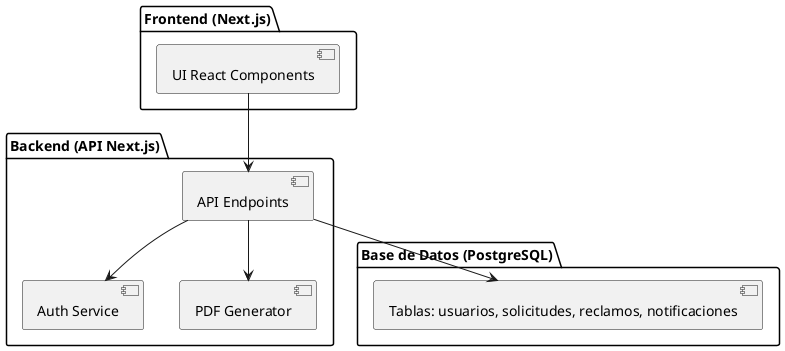
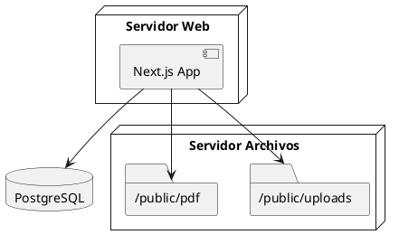
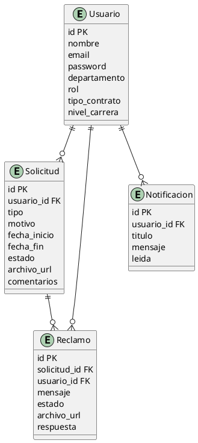
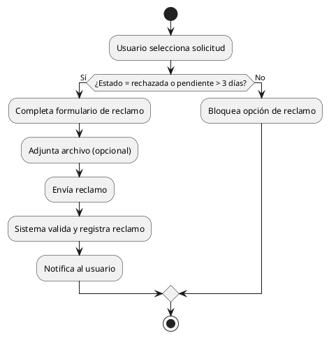

# Documentación Completa del Sistema de Gestión de Permisos

---

## 1. Comportamiento General de la Aplicación

La aplicación permite a empleados y administradores gestionar solicitudes de licencias, permisos y reclamos en una institución educativa. Los usuarios pueden:

- Registrarse e iniciar sesión.
- Crear solicitudes de licencia/permisos, adjuntar archivos y hacer seguimiento.
- Recibir notificaciones sobre el estado de sus solicitudes.
- Presentar reclamos si una solicitud es rechazada o está pendiente más de 3 días.
- Descargar memorandos en PDF generados automáticamente al aprobar solicitudes.

Los administradores pueden:

- Revisar, aprobar o rechazar solicitudes y reclamos.
- Gestionar usuarios y ver estadísticas.
- Generar y consultar memorandos en PDF.
- Acceder a paneles de control con gráficos y reportes.

---

## 2. Documentación Técnica Detallada

### Arquitectura

- **Frontend:** Next.js (React), componentes en `/components`.
- **Backend:** API RESTful en `/app/api`.
- **Base de datos:** PostgreSQL.
- **Autenticación:** JWT, roles (usuario/admin).
- **Almacenamiento:** Archivos en `/public/uploads`, PDFs en `/public/pdf`.

### Principales Entidades

- **Usuario:** nombre, email, contraseña, departamento, rol, tipo de contrato, nivel de carrera, contrato adjunto.
- **Solicitud:** tipo, motivo, fechas, estado, adjunto, comentarios, usuario asociado.
- **Reclamo:** mensaje, estado, archivo adjunto, solicitud asociada, respuesta.
- **Notificación:** usuario, título, mensaje, leída.
- **Tipos de contrato y niveles de carrera:** tablas auxiliares.

### Endpoints Principales

- `POST /api/auth/login` — Login de usuario.
- `POST /api/auth/register` — Registro de usuario.
- `GET /api/solicitudes` — Listar solicitudes del usuario.
- `POST /api/solicitudes` — Crear nueva solicitud.
- `PATCH /api/solicitudes/:id` — Actualizar estado de solicitud (admin).
- `GET /api/reclamos` — Listar reclamos del usuario.
- `POST /api/reclamos` — Crear nuevo reclamo.
- `PATCH /api/reclamos/:id` — Actualizar estado/respuesta de reclamo.
- `GET /api/notificaciones` — Listar notificaciones del usuario.
- `PATCH /api/notificaciones` — Marcar notificaciones como leídas.
- `GET /api/admin/solicitudes` — Listar todas las solicitudes (admin).
- `GET /api/admin/users` — Listar usuarios (admin).

### Flujo de Solicitudes

1. El usuario inicia sesión y accede a su panel.
2. Puede registrar una nueva solicitud completando el formulario y adjuntando archivos.
3. El sistema genera un número de expediente y notifica al usuario.
4. El administrador revisa las solicitudes y puede aprobar/rechazar.
5. Al aprobar, se genera un memorando PDF y se notifica al usuario.
6. Si la solicitud es rechazada o está pendiente más de 3 días, el usuario puede presentar un reclamo.

### Flujo de Reclamos

1. El usuario presenta un reclamo asociado a una solicitud.
2. El administrador revisa el reclamo y responde (aprobando/rechazando).
3. Si el reclamo es aprobado y la solicitud estaba rechazada, se actualiza a aprobada y se genera el memorando PDF.

### Notificaciones

- Se generan automáticamente en cada acción relevante (creación, aprobación, rechazo, respuesta a reclamo).
- El usuario puede marcar notificaciones como leídas.

### Seguridad

- Validación de roles y permisos en cada endpoint.
- Validación de campos obligatorios y tipos de archivo.
- Las contraseñas deben ser hasheadas en producción.

---

## 3. Diagramas UML y de Flujo

### 1. Diagrama de Casos de Uso (UML)

---

### 2. Diagrama de Clases (UML)

---

### 3. Diagrama de Secuencia (UML) — "Registrar Solicitud"

---

### 4. Diagrama de Actividades (UML) — "Aprobación de Solicitud"

---

### 5. Diagrama de Componentes (UML)

---

### 6. Diagrama de Despliegue (UML)

---

### 7. Diagrama de Base de Datos / Modelo ER

---

### 8. Diagrama de Flujo (Flowchart) — "Presentar Reclamo"

---

## 4. Consideraciones Finales

- El sistema es extensible y preparado para nuevas funcionalidades.
- Los diagramas pueden ser visualizados con PlantUML o herramientas UML online.
- Para dudas, consultar el archivo `README.md` o contactar al equipo de desarrollo.

